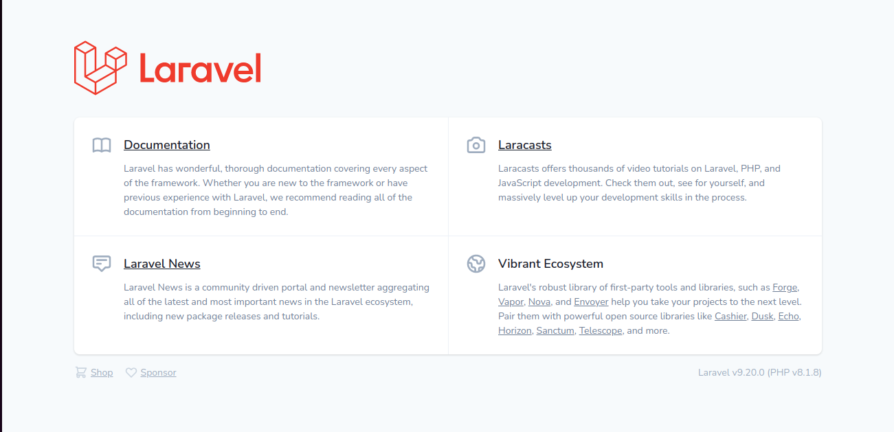

# Projeto Individual Com Laravel

O Laravel que é o framework PHP e open-souce criado por Taylor B. Otwell para desenvolvimento de sistemas Web. Totalmente FREE!

## INÍCIO
<details>
    <summary>
        Criar um CRUD em PHP, utilizando Laravel
    </summary>
<hr>

## CRUD (Create, Read, Update, Delete) é um acrônimo para as maneiras de se operar em informação armazenada.
Quando falamos de Darta Base, a primeria coisa que vem a mente é que iremos usar algum framework para criarmos nosso banco e suas tabelas, que iremos ter que fazer tudo a mão, digitando os primeiros comandos e ou tudo do gênero que envolve a manipulação do banco de dados.

Para quem é inicante já pensa, "mas não sei nada sobre banco de dados, vou ter que estudar como fazer para depois voltar a usar o Laravel?".

O Laravel nos ajuda em quase tudo, quando se trata de banco de dados, umas das coisa que precisamos para começar é definir qual framework iremos tratar ou visualizar nosso banco quando for criado.

Neste projeto faço uso do MySQL Workbench.

## Frameworks

- VScode-IDE
- MySQL Workbench
- Laravel
- PHP-8.1
- composer
- SO-Ubuntu 21.10

Criando o projeto Laravel usando o terminal integrado do VSCode.
```bash
composer create-project laravel/laravel crud-app
```
Se tudo ocorreu bem na instalação o projeto deverá abrir no navegador. Para isso deve está dentro do diretorio do projeto criado "crud-app".
```bash
php artisan serve
```


</details>
<hr>
<br>

## DATA BASE 
<details>
    <summary>
        Utilizar o banco de dados Mysql para criar uma tabela - de sua preferência, com 10 atributos
    </summary>
<hr>

## Tabela

| user         | Description   |
| -----------  | -----------   |
| name         | Taina         |
| phone        | 11-00000000   |
| cpf          | 12345678900   |
| age          | 27            |
| rg           | 1001001       |
| email        | taina@mail.com|
| sex          | feminino      |
| civil_status | solteira      |
| postal_code  | 68000123      |
| profession   | estudante     |
| password     | kjhjkhjkhkj   |
<hr>
 
## Migrations

Segundo a documentação do Laravel:
>As migrações são como controle de versão para seu banco de dados, permitindo que sua equipe defina e compartilhe a definição do esquema de banco de dados do aplicativo. Se você já teve que dizer a um colega de equipe para adicionar manualmente uma coluna ao esquema de banco de dados local depois de obter suas alterações do controle de origem, você enfrentou o problema que as migrações de banco de dados resolvem.

Para dar start na criação do banco precisamos primeiramente fazer as configurações nescessárias.

- Ter um SGBD
- Saber sua credencial de acesso ao banco como nome_usuario e senha

Com o Workbench crio a minha base dados para guardar minha informações que viram do APP.

```sql
CREATE DATABASE myBank;
```
Precisamos somente de ter o banco criado, os proximos passos como criação de tabelas será feito atraves do Laravel.

**Arquivo .env**
Por padrão no laravel já vem pré configurado para fazer nosso app se comunicar com o banco, apenas será nescessário passar nossa credêncial de acesso ao banco.

```laravel
DB_CONNECTION=mysql
DB_HOST=127.0.0.1
DB_PORT=3306
DB_DATABASE= "nome_do_banco"
DB_USERNAME= "nome_usuario"
DB_PASSWORD= "senha_de_acesso"
```
Com os campos devidamente preenchido, o Laravel tera acesso ao banco.

Perceba que o Laravel como citado antes nos ajuda bastante no desenvolvimento pois é um framework que ajuda o desenvolvedor a se dedicar apenas com o modelo de negócio.

Na raiz do projeto existe um diretório que é bem sugestivo /database, esse diretorió ou repositorio é onde esta as ferramentas que nescessitamos para digamos gerenciar os dados.

Abrindo o /database encontamos outros diretorios e para esse momento temos o /migrations com outros arquivos.

**2014_10_12_000000_create_users_table.php** esse arquivo tambem é bastante sujestivo ele cria a tabela usuarios em nosso banco simples e fácil. 

Basta rodarmos o seguinte comando no terminal do VSCode:

```bash
php artisan migrate
```
Após o comando, como temos outros arquivos ele criara tambem outras tabelas em nosso banco:
```bash
Migration table created successfully.
Migrating: 2014_10_12_000000_create_users_table <---
Migrated:  2014_10_12_000000_create_users_table (2,163.51ms)
Migrating: 2014_10_12_100000_create_password_resets_table
Migrated:  2014_10_12_100000_create_password_resets_table (1,787.09ms)
Migrating: 2019_08_19_000000_create_failed_jobs_table
Migrated:  2019_08_19_000000_create_failed_jobs_table (2,010.34ms)
Migrating: 2019_12_14_000001_create_personal_access_tokens_table
Migrated:  2019_12_14_000001_create_personal_access_tokens_table (2,644.20ms)
```


Veja que maneiro, o Laravel se encarregou de criar as primeiras tabelas com suas colunas padronizadas para começarmos a dar os primeiros passos na manipulação.

Mas ai vem uma pergunta, como preenchemos a tabela?, para quem já conhece como trabalhar com banco de dados poderia fazer tudo na mão, mas para os iniciantes o framework ja vem com funcionalidades que nos ajudam a praticar o desenvolvimento até pegarmos a pratica, pensando nisto e respondendo a pergunta ele tambem já pensou nisso.

## Seeders

Para nos ajudar a ser mais produtivo para ter um dominio sobre a ferramenta, temos como tambem popular as tabelas.

**/database/seeders** ao acessar essa rota na raiz do projeto, temos o arquivo que cria dados fakes para popular o banco, assim facilitando nosso estudo sobre a ferramenta.

No arquivo DatabaseSeeder.php terá uma class com o seu conteudo comentado é só descomentar e rodar o comando:

```laravel
   public function run()
    {
       // \App\Models\User::factory(10)->create();

      //  \App\Models\User::factory()->create([
      //      'name' => 'Test User',
      //      'email' => 'test@example.com',
        ]);
    }
```
Comando:

```bash
php artisan db:seed
```


**Esses passos foram essências até aqui pois podemos confirmar que nossa aplicação está se comunicando com nosso banco de dados que está hospedado em nossa maquina local.** 

Para dar continuidade, precisamos visualizar em nosso projeto como os dados estão armazenados em nosso banco para isso criamos uma pagina web para melhor visualizar e podemos alterar de forma mais compreencivel.

## Controller, Routers e View

Para termos certeza que nosso APP está conversando com o banco vamos fazer um teste mostrando os dados em uma pagina web.

Na View criamos nossa rota para chamar a nossa página web. Na raiz do projeto /routes encontraremos o nosso arquivo **web.php**, nele criamos uma rota:

```php
Router::get('/users',[UserController::class,'index'])->name('users.index');
```
## Contrroller
O Laravel Controller é onde manipulamos a lógica de tratamento das requisições recebendo os dados do model e transmitindo-os para a view.

Veja que ao definirmos um *UserController* ele ainda não existe em nosso projeto para isso precisamos crialo atraves da linha de comando:

```bash
php artisan make:controller **U**ser**C**ontroller
```
Sempre criamos usando os padroes do Laravel primeira letra maiuscula das palavras compostas.

Para saber se ela foi criada você tera uma mensagem como esta em seu terminal apos rodar o comando:

```bash
Controller created successfully.
```
Tambem pode navegar pela raiz do projeto /app/Http/Controllers nesse diretorio você verá seu controller criado.

Agora na view.php basta selecionar *UserController* em seu teclado **Ctrl + espaço** que ele importar automaticamente para a view.

## UserController.php

**Teste**

Vamos testar se conseguimos ter acesso aos dados via Laravel.

Com o rota criada na **/View/web.php** Route::get('/users',[UserController::class,'index'])->name('user.index'); e com o o controlador tambem criado app/Http/Controllers/UserController.php vamos fazer nosso primeiro teste.

Crinado essa função podemos visualizar os dados na do nosso banco de dados na web.

```php
    public function index()
    {
        $users = User::all();

        dd($users);
    }
```
Basta adiciona-la na nossa Controller criada.


Esse pequeno codigo ou função, armazena em uma variavel **$users** o retorno do **User** ou seja da chamada de todos os usuários listados em nosso banco e é mostrado em tela o array criado na variavel atraves do *dd($users);*.


## Criando as colunas que faltam da [tabela](#tabela) que mostrei no início.

<hr>

**Comandos**

Para criar uma nova coluna na base de dados precisamos criar uma migration:

```bash
php artisan make:migration add_colluns_to_users_table
```

Migration criada:

```php
<?php

use Illuminate\Database\Migrations\Migration;
use Illuminate\Database\Schema\Blueprint;
use Illuminate\Support\Facades\Schema;

return new class extends Migration
{
    /**
     * Run the migrations.
     *
     * @return void
     */
    public function up()
    {
        Schema::create('users', function (Blueprint $table) {
            //
        });
    }

    /**
     * Reverse the migrations.
     *
     * @return void
     */
    public function down()
    {
        Schema::drop('users',function(Blueprint $table){
            //
        });
    }
};

```
Configurando a migration criada:

```php
<?php

use Illuminate\Database\Migrations\Migration;
use Illuminate\Database\Schema\Blueprint;
use Illuminate\Support\Facades\Schema;

return new class extends Migration
{
    /**
     * Run the migrations.
     *
     * @return void
     */
    public function up()
    {
        Schema::table('users', function (Blueprint $table) {
            $table->string('phone')->nullable()->after('email');
            $table->string('cpf')->nullable()->after('email');
            $table->string('age')->nullable()->after('email');
            $table->string('rg')->nullable()->after('email');
            $table->string('sex')->nullable()->after('email_verified_at');
            $table->string('status_civil')->nullable()->after('email_verified_at');
            $table->string('postal_code')->nullable()->after('email_verified_at');
            $table->string('profession')->nullable()->after('email_verified_at');
        });
    }

    /**
     * Reverse the migrations.
     *
     * @return void
     */
    public function down()
    {
        Schema::table('users', function (Blueprint $table) {
            $table->dropColumn('phone');
            $table->dropColumn('cpf');
            $table->dropColumn('age');
            $table->dropColumn('rg');
            $table->dropColumn('sex');
            $table->dropColumn('status_civil');
            $table->dropColumn('postal_code');
            $table->dropColumn('profession');
        });
    }
};
```
Assim as novas colunas serão criadas na base de dados, caso algo de errado na criação, basta parar a aplicação caso esteja rodado no servidor, e rodar o comando para limpar o cache:

```bash
php artisan optimize
```

Caso queira reverter a criação das colunas:

```bash
php artisan migrate:rollback
```

Agora que os dados estão chegando na Controller, podemos criar um layout para aprensentar melhor esses dados.
[Estilizando o Front End](#front-end)


</details>
<hr>
<br>

## AUTENTICAÇÃO
<details>
    <summary>
        O sistema deverá possuir autenticação
    </summary>

</details>
<hr>
<br>

## CRUD
<details>
    <summary>
        O CRUD deve conter os métodos de Insert, Update, Delete e Read dessa tabela
    </summary>

## Insert

**Para começar:**

Criar rota (web.php):

```php
Route::get('/users/insert',[UserController::class,'insert'])->name('users.insert);
```
Criar função para mostrar a pagina de inserir usuario (UserController.php):

```php
public function insert()
{
    return view('users.insert');
}
```

Criar view (/views/users):

```
insert.blade.php
```
[Ver layout...](#front-end)

Depois de criar o formulario, quando o botão de enviar for clicado os dados serão armazenados no banco de dados.

Função simples de teste:

```php

    public function store(Request $request)
    {
        $user = new User;
        $user->name = $request->name;
        $user->email = $request->email;
        $user->rg = $request->rg;
        $user->age = $request->age;
        $user->cpf = $request->cpf;
        $user->phone = $request->phone;
        $user->profession = $request->profession;
        $user->postal_code = $request->postal_code;
        $user->status_civil = $request->status_civil;
        $user->sex = $request->sex;
        $user->password = $request->cpf;
        $user->save();
    }
    
```

## ERROR

Nessa sessão me deparei com o sequinte problema, na criação do projeto usei a migrate padrão do Laravel e inseri novas colunas, até o momento de criar o formulário para inserir novo usuário usando o código simples ele funcionava, depois que usei a segunda forma de função me retorna um problema com o _token só que não consegui descifrar o problema.

**Função 2:**

```php
    public function store(Request $request)
    {
        $data = $request->all();
        $data['password'] = bcrypt($request->cpf);

        $this->model->insert($data);

        return redirect()->route('users.index');
    }
```
**_TOKEN**


## COMO PRECISO CONCLUIR O CRUD CRIEI OUTRO PROJETO

</details>
<hr>
<br>

## FRONT END
<details>
    <summary>
        As ações deverão ser realizadas através de uma página web, portanto o sistema deverá conter um frontend que se comunique com o backend
    </summary>
<br>

## Criando interface para que possamos visualizar os dados em uma pagina web.
<hr>
Para listar os usuario na pagina web, nessa primeira fase, fiz uma interface simples para visualizar os dados que estão vindo do banco de dados.

**Bootstrap**

Aqui utilizei o bootstrap para estilizar a minha pagina. Tambem ja adicionei um botão para começar a pensar em como trabalhar essas informações.

## Layout Lista Usuarios


No Laravel, no arquivo web.php tenho a seguinte rota: 

```php
 Route::get('/users',[UserController::class,'index'])->name('users.index');
```
Utilizarei a rota acima para acessar a pagina onde mostrarei a lista dos meu usuarios criados. Para isso na minha controller UserController na função index que criei para chamar a pagina index.blade.php, irei passar o seguinte comando  para mostrar os dados dos usuarios da minha tabela do banco de dados.

**Listando todos os usuarios cadastrado**

```php
public function index()
    {
        $users = User::all();

        dd($users);
    }
```

O codigo acima tras todos os usuarios da minha tabela e armazena essa lista em uma vareavel e o dd() se encarrega de mostrar essa lista na minha pagina, uso isso apenas para saber se os dados estão chegando.

Agora irei organizar essas informações usando o Bootstrap, na pasta View, crio a view "index.blade.php" para criar o layout da pagina.

**resources/views/users/index.blade.php**

O diretorio onde armazenamos as interfaces que criamos se chama **Resources**

Criei uma pasta users para organizar minhas views de usuarios, criei a view da listagem de usuarios com o nome de "index". Na mesma criei e estruturei uma tabela usando o Bootstrap e PHP para criar a tabela onde estará listados os dados.

```html
<table class="table">
  <caption>Lista de Usuários</caption>
  <thead>
    <tr>
      <th scope="col">ID</th>
      <th scope="col">NOME</th>
      <th scope="col">EMAIL</th>
      <th scope="col">DATA CADASTRO</th>
      <th scope="col">AÇÕES</th>
    </tr>
  </thead>
  <tbody>
      @foreach ($users as $user)
          <tr>
              <th scope="row">{{$user->id}}</th>
              <td>{{$user->name}}</td>
              <td>{{$user->email}}</td>
              <td>{{date('d/m/Y - H:i',strtotime($user->created_at))}}</td>
              <td><a href="{{route('users.show',$user->id)}}" class="btn btn-info text-white">VER</a></td>
          </tr>
      @endforeach
  </tbody>
</table>
```
[Imagem do layout com os dados](#layout-lista-usuarios)

**Listando um Usuario**

Como criei uma tabela onde tem um botão para ver os dados do usuario em especifico agora crio uma função para que quando clicar no botão os dados do usuario selecionado seja mostrado.

Voltando na controller UserController crio a seguinte função chamada de show, ela tem uma validação que se um usuario for selecionado ela retorna a pagina para mostrar os dados de um usuario "show.blade.php", no caso ele não encontre o usuario ela retorna "index.blade.php":

```php
    public function show($id)
    {
        //$user = User::find($id);
        if(!$user = User::where('id',$id)->first())
            return redirect()->route('users.index');

        $title = 'Usuario '.$user->name;

        return view('users.show', compact('user','title'));
    }
```
Agora preciso ter minha view para mostar o usuario, **resources/views/users/show.blade.php**, com a view show criada:

```html
<table class="table">
    <caption>Usuário: {{$user->name}}</caption>
    <thead>
      <tr>
        <th scope="col">ID</th>
        <th scope="col">NOME</th>
        <th scope="col">EMAIL</th>
        <th scope="col">DATA CADASTRO</th>
        <th scope="col">AÇÕES</th>
      </tr>
    </thead>
    <tbody>
        <tr>
            <th scope="row">{{$user->id}}</th>
            <td>{{$user->name}}</td>
            <td>{{$user->email}}</td>
            <td>{{date('d/m/Y - H:i',strtotime($user->created_at))}}</td>
            <td class="btn-group" role="group">
                <a href="#" class="btn btn-warning text-white">EDITAR</a>
                <a href="#" class="btn btn-danger text-white">DELETAR</a>
            </td>
        </tr>
    </tbody>
</table>
```


## Blade

Segundo a Doc Laravel:

>Blade é o mecanismo de modelagem simples, mas poderoso, incluído no Laravel. Ao contrário de alguns mecanismos de modelagem PHP, o Blade não restringe o uso de código PHP simples em seus modelos. Na verdade, todos os modelos do Blade são compilados em código PHP simples e armazenados em cache até serem modificados, o que significa que o Blade adiciona essencialmente zero sobrecarga ao seu aplicativo. Os arquivos de modelo blade usam a .blade.phpextensão de arquivo e geralmente são armazenados no resources/viewsdiretório.

Deixando mais dinâmico os layout.

**resources/views/template/users.blade.php**

Apenas organizamos as partes do Html para que seja chamado em qualquer arquivo, isso facilita e diminuir o numero de linhas de codigos das views, deixando mais limpo e dinamico o projeto.


Usando os comandos do Blade consigo manipular a forma que minhas telas se comportam. Na imagem anterio
é usado um comando ```@yeld('nome_do_comando')``` entre os parentes dou um nome para o comando.

Agora como fica nas outras views.


## Layout Cadastro Usuário

Para facilitar a inserssão de dados, criei uma view para salvar os dados no banco.

```Html
<div class="container py-5">
    
    <form action="{{ route('users.store') }}" method="POST" class="mt-5"> 
      @csrf
          <div class="form-row">
            <div class="form-group col-md-5">
              <label for="name">Nome</label>
              <input type="text" class="form-control" id="name" name="name" placeholder="Pedro" >
            </div>
            <div class="form-group col-md-1">
              <label for="age">Idade</label>
              <input type="text" class="form-control" id="age" name="age" placeholder="21">
            </div>
            <div class="form-group col-md-3">
              <label for="cpf">CPF</label>
              <input type="text" class="form-control" id="cpf" name="cpf" placeholder="123.123.123-12">
            </div>
            <div class="form-group col-md-3">
              <label for="rg">RG</label>
              <input type="text" class="form-control" id="rg" name="rg" placeholder="1111001">
            </div>
          </div>
          <div class="form-row">
            <div class="form-group col-md-6">
              <label for="phone">Telefone</label>
              <input type="tel" class="form-control" id="phone" name="phone" placeholder="99 99999-9999">
            </div>
            <div class="form-group col-md-6">
              <label for="email">E-mail</label>
              <input type="email" class="form-control" id="email" name="email" placeholder="exemp@gmail.com">
            </div>
          </div>
          <div class="form-row">
            <div class="form-group col-md-2">
              <label for="status_civil">Estado Civíl</label>
              <input type="text" class="form-control" id="status_civil" name="status_civil" placeholder="União estável">
            </div>
            <div class="form-group col-md-2">
              <label for="sex">SEX</label>
              <input type="text" class="form-control" id="sex" name="sex" placeholder="SEXO">
            </div>
            <div class="form-group col-md-4">
              <label for="profession">Profissão</label>
              <input type="text" class="form-control" id="profession" name="profession" placeholder="Freelancer">
            </div>
            <div class="form-group col-md-4">
              <label for="postal_code">CEP</label>
              <input type="text" class="form-control" id="postal_code" name="postal_code" placeholder="00011100">
            </div>
          </div>       
          <button type="submit" class="btn btn-primary">Submit</button>
    </form>
</div>
```


</details>
<hr>
<br>

## TESTING
<details>
    <summary>
        A solução deve ter pelo menos 30% de testes unitários 
    </summary>
</details>
<hr>
<br>

## Um quadro de empregos

Uma breve descrição sobre o que esse projeto faz e para quem ele é

Qualquer projeto que te force a permitir que as pessoas usuárias insiram como vários tipos de usuários, adiciona um aspecto interessante do design.

Como você garantirá que a maneira como os/as empregadores/as utilizam o site atenda às suas necessidades em relação à prospecção de empregos?

Como a maioria dos outros projetos, você não precisa se concentrar em tudo de uma só vez. Comece tentando criar a capacidade de criar um anúncio de emprego.

Então, você pode se concentrar nas pessoas que buscam emprego e em como elas respondem.

Habilidades: banco de dados, desenvolvimento web e programação geral.
